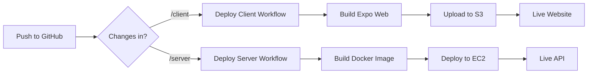

# 🎉 AWS Infrastructure Setup Complete!

## ✅ Successfully Created

### AWS Resources

- ✅ **S3 Bucket**: `lab1-todoapp` (configured for static website hosting)
- ✅ **EC2 Key Pair**: `lab1-todoapp-key` (saved to ~/.ssh/lab1-todoapp-key.pem)
- ✅ **Security Group**: `lab1-todoapp-sg` (with SSH, HTTP, HTTPS access)
- ✅ **EC2 Instance**: `i-046d4e1e286e3032d` (Ubuntu 22.04, t3.micro)

### Instance Details

- **Instance ID**: `i-046d4e1e286e3032d`
- **Public IP**: `56.228.14.41`
- **Private IP**: `172.31.27.207`
- **Region**: `eu-north-1` (Stockholm)
- **AMI**: `ami-07e075f00c26b085a` (Ubuntu 22.04 LTS)

### GitHub Actions Workflows

- ✅ `/.github/workflows/deploy-client.yml` - Deploy Expo web to S3
- ✅ `/.github/workflows/deploy-server.yml` - Deploy Node.js API to EC2

## 🔧 Manual Setup Required: GitHub Secrets

Go to: **https://github.com/warteamx/lab1-todoApp/settings/secrets/actions**

Add these secrets (Name → Value):

### AWS Configuration

```
AWS_ACCESS_KEY_ID → [Your AWS Access Key]
AWS_SECRET_ACCESS_KEY → [Your AWS Secret Key]
AWS_REGION → eu-north-1
```

### S3 Configuration

```
S3_BUCKET → lab1-todoapp
```

### EC2 Configuration

```
EC2_INSTANCE_ID → i-046d4e1e286e3032d
EC2_HOST → 56.228.14.41
EC2_USER → ubuntu
```

### SSH Private Key

```
EC2_PRIVATE_KEY → (content of the SSH private key below)
```

**SSH Private Key Content:**
Run this command to get the key:

```bash
cat ~/.ssh/lab1-todoapp-key.pem
```

### Supabase Configuration

Get these from your Supabase dashboard or server/.env.example:

```
SUPABASE_DB_URL → postgresql://postgres.<UUID>:<PASSWORD>@aws-0-us-east-2.pooler.supabase.com:5432/postgres
SUPABASE_KEY → sb_secret_<PASSWORD>
SUPABASE_URL → https://<PROJECT_ID>.supabase.co
```

## 🚀 Deployment URLs

Once secrets are configured:

### Client (Web App)

- **S3 Website**: http://lab1-todoapp.s3-website.eu-north-1.amazonaws.com
- **Deploys on**: Push to main/22-deploy-to-aws branch with changes in `/client`

### Server (API)

- **EC2 Instance**: http://56.228.14.41/api
- **Health Check**: http://56.228.14.41/api/health
- **Deploys on**: Push to main/22-deploy-to-aws branch with changes in `/server`

## 🧪 Testing the Setup

### 1. Test SSH Connection

```bash
ssh -i ~/.ssh/lab1-todoapp-key.pem ubuntu@56.228.14.41
```

### 2. Manual Deployment Test

After setting up GitHub secrets, you can test by:

- Going to **Actions** tab in GitHub
- Running workflows manually
- Or pushing a small change to trigger automatic deployment

### 3. Verify Services

- Client: Visit S3 website URL
- Server: Visit http://56.228.14.41/api/health

## 💰 Cost Estimation

**Free Tier Eligible:**

- EC2 t3.micro: 750 hours/month free (first 12 months)
- S3: 5GB storage free
- Data Transfer: 100GB/month free

**Estimated cost after free tier**: ~$8-12/month

## 🔄 CI/CD Workflow



## 📚 Next Steps

1. **Set up GitHub secrets** (see above)
2. **Configure Supabase environment variables**
3. **Test the deployment** by pushing a change
4. **Optional**: Set up CloudFront for better performance
5. **Optional**: Configure custom domain with Route 53

## 🛠️ Troubleshooting

### Common Issues

- **SSH fails**: Check security group allows port 22
- **Deployment fails**: Verify all GitHub secrets are set correctly
- **Server not responding**: Check EC2 instance is running and Docker is installed

### Useful Commands

```bash
# Check EC2 instance status
aws ec2 describe-instances --instance-ids i-046d4e1e286e3032d --region eu-north-1

# SSH to server
ssh -i ~/.ssh/lab1-todoapp-key.pem ubuntu@56.228.14.41

# Check Docker container logs
sudo docker logs lab1-todoapp-server
```

Your AWS deployment infrastructure is now ready! 🎉
